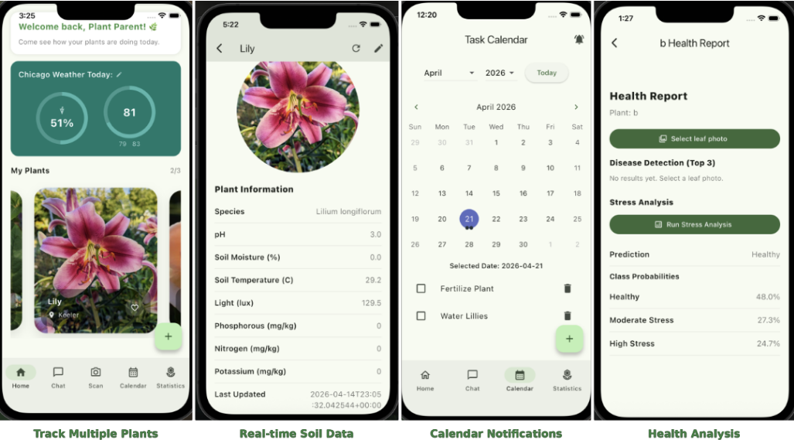
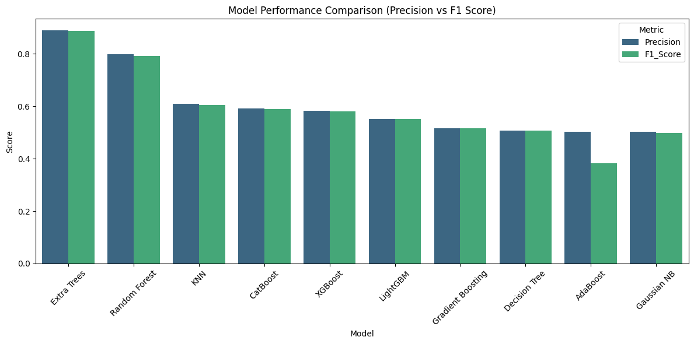
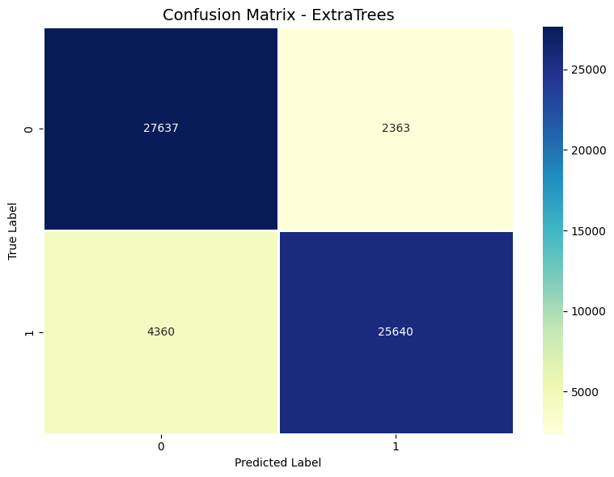
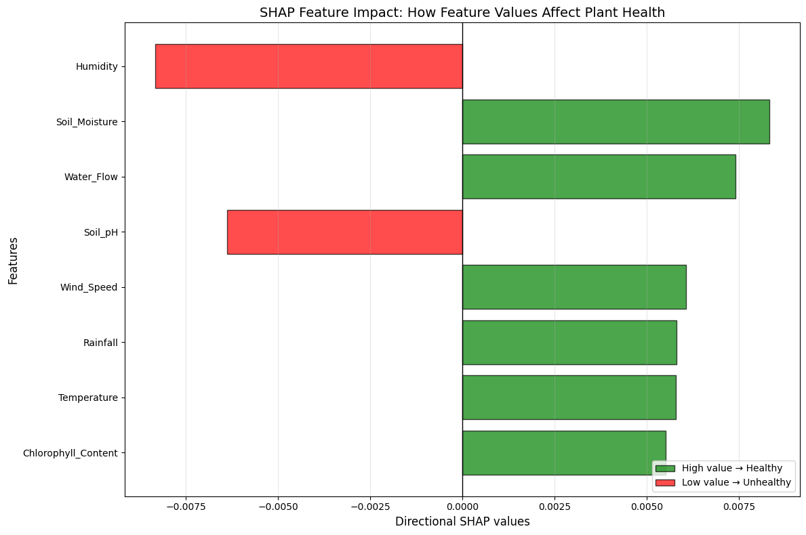
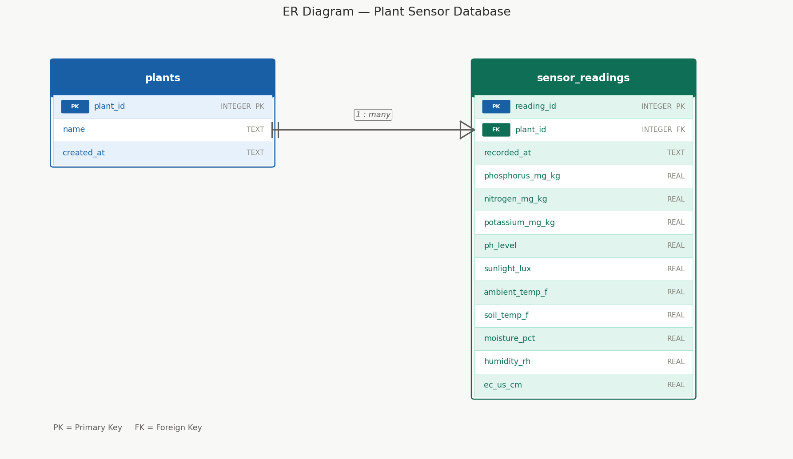
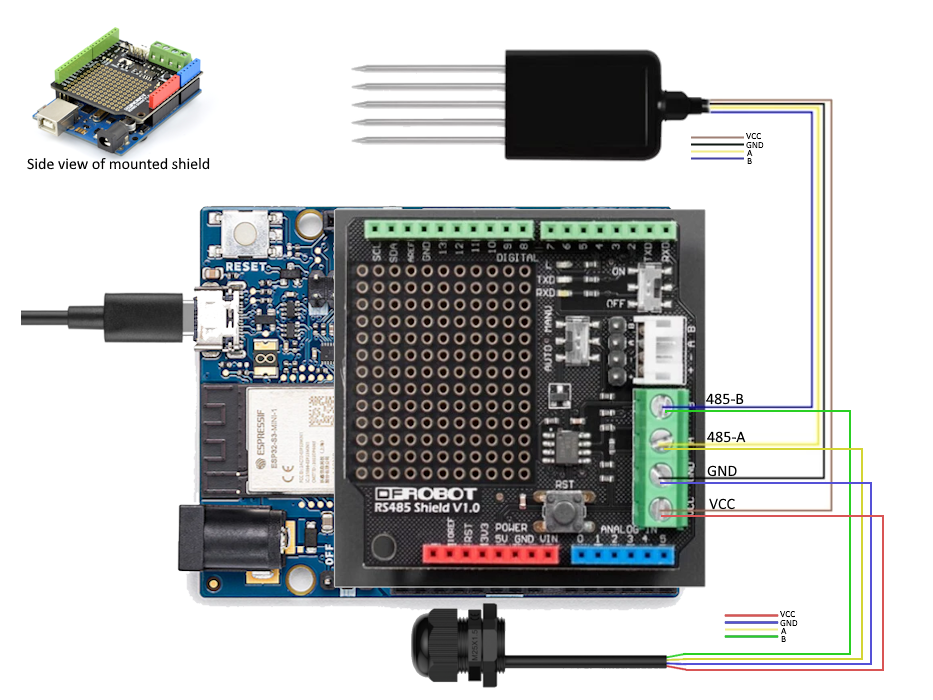

<p align="center">
  
</p>

# Bloom Buddy 

### Team
[](https://github.com/Smemedi/Bloom_Buddy/graphs/contributors)

Co-leads: [Victoria Li](https://www.linkedin.com/in/victoria-l-78719628b/) & Zuha Ansari  
Database: Elijah Hoedl  
Training Models: [Eileen Garay](https://www.linkedin.com/in/eileen1129/) & Elijah Perez  
Backend: Sokol Memedi  
UI/UX: Ariah Pittman  

Course: DS 480 / IPRO 497  
Instructors: [Robert Ellis](https://www.linkedin.com/in/robert-ellis-6914463/) & Ananya Bhooplam Praveen   
Subject-matter Expert: Gina Iliopoulos - Keeler Gardens


## Summary

An application to optimize your garden and take care of your plants. Features include a plant scanner to detect the health of the plant, a task calendar to monitor and organize tasks, a statistics dashboard that uploads live data from our companion sensor device, and weather dashboard to display current weather patterns.



**What problem are you solving?**  
We are solving the problem of the low community of gardeners, we want to bring more attention to the beautiful community by introducing a new way of gardening and farming. We want to build an accessible, beginner friendly mobile app that can mitigate the common issues aspiring gardeners face when starting out. For instance, instead of guessing whether the plant is healthy, we have the device to tell the client if their plant is healthy or unhealthy.    
**Why is it important?**    
Indoor and backyard farming improves mental well-being by reducing stress and creating a calming connection to nature. It also helps people grow fresh, healthy food at home, reducing reliance on store-bought produce and lowering food costs.      
**Who is the stakeholder/sponsor?**  
The stakeholders are the Chicagoans.    
**What are your key results?**    
From the machine learning side of the project, the model has a 88% accuracy score with the ability to tell the user why their plant is unhealthy. Other key results include connecting the companion device to be interfaced on the app and combining multiple sensors into one. 

## Introduction
**Background of the problem**  
Despite the growing popularity gardening, many individuals lack the technical knowledge required to effectively monitor plant health and optimize growth conditions. Traditional gardening often relies on manual observation and experience, which can lead to inconsistent results, misdiagnosis of plant diseases, and inefficient care routines.  
**Context and motivation**  
Recent advancements in mobile applications, Internet of Things (IoT) devices, and machine learning have created new opportunities to modernize plant care. The motivation behind this project is to unify these technologies into a single, cohesive system that enhances accessibility and usability for both novice and experienced gardeners.  
**Why this problem matters**  
Inefficient plant care not only discourages participation in gardening but also leads to wasted resources such as water, soil, and plant materials. Additionally, the absence of a strong, connected gardening community reduces knowledge sharing and long-term engagement. Addressing these challenges can improve user success rates, promote sustainable practices, and increase adoption of home-based food production.  
**Overview of our approach**  
This project proposes a multi-component application that integrates computer vision, IoT sensor data, and user interaction features. A neural network-based plant scanner analyzes images to detect signs of disease or stress, while a companion sensor device collects real-time environmental data such as soil moisture, temperature, and light levels. This data is processed and visualized through a statistics dashboard to provide actionable insights. 

## Project Structure
```
Bloom_Buddy/  
│── .vscode/                 # Development environment settings for Visual Studio Code  
│── Plant_stress_predict/    # Notebooks and models for plant stress analysis and prediction  
│── app/                     # Main application logic and user interface components  
│── arduino/                 # Embedded system code for sensor data collection  
|── backend/                 # Database & server backend logic for application
│── Images/                  # Project images and visualizations  
│── README.md                # Comprehensive project documentation  
│── .gitattributes           # Repository configuration for consistent file handling
```
## Methodology

### Plant stress prediction:

The project starts with preprocessing agricultural sensor data from a CSV file, where certain features are removed to keep only edge-deployable sensor inputs. Exploratory data analysis follows, including target distribution, feature correlations, outlier detection using IQR, and distribution checks (skewness, normality, and KDE), along with pairplots of key features. *See the EDA section* → [link](Plant_stress_predict/Edge_plant_det.ipynb#EDA).

To handle class imbalance, SMOTE, ADASYN, and random resampling are compared, with the latter creating a balanced dataset of 300K samples. *See the imabalnced data section* → [link](Plant_stress_predict/Edge_plant_det.ipynb#Fixing_Imbalanced_Data). The data is then split (80/20, stratified), normalized using StandardScaler, and evaluated across 10 classifiers using precision and F1-Score. *See ML comparions section* → [link](Plant_stress_predict/Edge_plant_det.ipynb#Prediction_Models).

ExtraTreesClassifier performs best and is further optimized via grid search, balancing performance and model size. *See optimize model section*  → [link](Plant_stress_predict/Edge_plant_det.ipynb#Optimize_Model). SHAP is used for interpretability, highlighting feature importance and identifying key stress factors affecting predictions. *See SHAP analysis section*  → [link](Plant_stress_predict/Edge_plant_det.ipynb#SHAP_Analysis).

Finally, the model, scaler, and encoder are saved and integrated into an inference script. The final model is an ExtraTreesClassifier (150 estimators, depth 20), optimized for edge deployment with SHAP-based insights. *See testing section*  → [link](Plant_stress_predict/Edge_plant_det.ipynb#Testing).

## Result & Visualization
<p align="center">

</p>
This chart compares the performance of multiple machine learning models evaluated during the project. Metrics such as presicion and F1-Score are visualized for each classifier, allowing for a clear comparison of their strengths and weaknesses. The figure demonstrates why the ExtraTreesClassifier was selected as the final model for deployment.

<p align="center">

</p>

This image displays the confusion matrix for the ExtraTreesClassifier model. It visually summarizes the model’s classification performance by showing the number of correct and incorrect predictions for each crop health class. The matrix highlights the model’s accuracy and any potential misclassifications, providing insight into which classes are most reliably predicted.

<p align="center">

</p>

This figure illustrates the SHAP feature importance analysis for the plant stress prediction model. Each feature’s impact on the model’s output is shown, indicating which sensor readings most strongly influence the prediction of plant health or stress. The plot helps interpret the model by revealing the most critical factors affecting its decisions.

<p align="center">

</p>
The following is the ER diagram that represents how the data is stored in the database. Each new plant gets their own individual plant identifier that is specific to them. The sensor readings are identified by both the id of the reading as well as the plant the reading is taken from. Each plant can have multiple sensor readings, but a sensor reading is only linked to one plant.

## Software/Hardware Instructions

### Server Startup
```bash
# Open backend directory on current path
cd backend

# Create virtual environment 
py -m venv env

# Activate virtual environment
.\env\Scripts\activate

# Install packages
pip install -r requirements.txt

# Start server
uvicorn server:app --host 0.0.0.0 --port 8000
```
### App Startup
```bash
# Open app directory 
cd ..
cd app

# Update flutter
flutter doctor

# Grab dependencies
flutter pub get

# Run & choose specified device
flutter run
```

### Arduino Instructions

<p align="center">
  
  Wiring Diagram
</p>

#### Setting Up Device
1. Connect the RS485 shield to the Arduino by slotting the shield's pins on top of the Arduino's slots
2. Use a USB cable to connect the device to a computer
3. Open the Arduino IDE and select the right board and port
#### Setting Up Sensors
1. Connect only the soil sensor and use the Arduino IDE to upload the "Set_Soil_Sensor_ID.ino"
2. After running it, power cycle the sensor by turning it off, then on again
3. Disconnect the soil sensor and plug in the light sensor
4. Upload the "Set_Light_BAUD_Rate.ino" and power cycle the device
#### Assembling Device
1. Plug in each wire to its respective slot
2. Make sure no wires are touching another port's wires and that every wire is connected in the right place
3. Edit "Sensor_reading.ino" and input wifi details and server IP address
4. Upload edited "Sensor_Reading.ino" to device
5. Ensure device is outputting data properly by looking at serial monitor at 9600 baud

## Data Access
[Crop Health Dataset](https://www.kaggle.com/datasets/datasetengineer/crop-health-and-environmental-stress-dataset/data)

## Conclusion

### What did we learned?

- Eileen Garay: learned how to address class imbalance by comparing popular oversampling techniques (SMOTE, ADASYN, Random Resampling). Additionally, I gained experience in hyperparameter optimization through grid search, testing various combinations of n_estimators and max_depth to balance model accuracy and storage efficiency.


## Future Work
Our team would love to expand the app to have a community base component/forum. Within the community side of the app, we would add future events within Chicago and post from gardeners from Chicago. Additionally, we would add a prediction model for certain plant statistics and push notifications when a stat is abnormal to ideal ranges.
From the database/ML team, we would love to get insight data from conservatory in Chicago and train the model on that data. 
